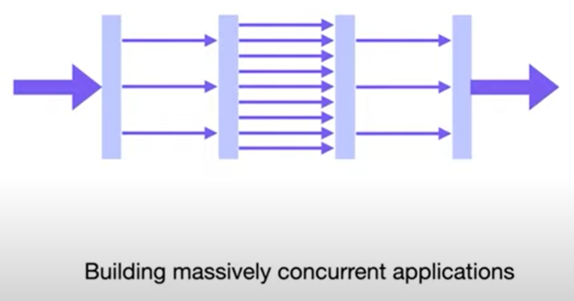
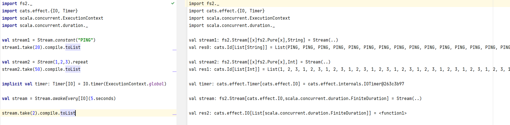

# MyScalaFS2

My Scala FS2

## FS2

FS2 is a library for purely functional, effectful, and polymorphic stream processing library in the Scala programming language. Its design goals are compositionality, expressiveness, resource safety, and speed. The name is a modified acronym for Functional Streams for Scala (FSS, or FS2).

FS2 is available for Scala 2.12, Scala 2.13, Scala 3, and Scala.js. FS2 is built upon two major functional libraries for Scala, Cats, and Cats-Effect. Regardless of those dependencies, FS2 core types (streams and pulls) are polymorphic in the effect type (as long as it is compatible with cats-effect typeclasses), and thus FS2 can be used with other effect libraries, such as Monix.

## fs2 sbt

https://fs2.io/#/getstarted/install

The latest version for Cats Effect 3 is 3.2.5, which supports Cats Effect 3 and is cross built for Scala 2.12, 2.13, and 3.0.

The latest version for Cats Effect 2 is 2.5.10, which supports Cats Effect 2 and is similarly cross built for various Scala versions.

But the strange thing is the FS2 release only shows 2.5.9???

https://github.com/typelevel/fs2/releases?page=2


For Cats Effect 3

```
libraryDependencies += "org.typelevel" %% "cats-core" % "2.3.0"
libraryDependencies += "org.typelevel" %% "cats-effect" % "2.5.3"

// available for 2.12, 2.13, 3.0
libraryDependencies += "co.fs2" %% "fs2-core" % "3.2.5"

// optional I/O library
libraryDependencies += "co.fs2" %% "fs2-io" % "3.2.5"

// optional reactive streams interop
libraryDependencies += "co.fs2" %% "fs2-reactive-streams" % "3.2.5"

// optional scodec interop
libraryDependencies += "co.fs2" %% "fs2-scodec" % "3.2.5"
```

For Cats Effect 2

```
libraryDependencies += "org.typelevel" %% "cats-core" % "2.3.0"
libraryDependencies += "org.typelevel" %% "cats-effect" % "2.5.3"

libraryDependencies += "co.fs2" %% "fs2-core" % "2.5.10"
```

For Scala.js

```
libraryDependencies += "co.fs2" %%% "fs2-core" % "3.2.5"
libraryDependencies += "co.fs2" %%% "fs2-io" % "3.2.5" // Node.js only
libraryDependencies += "co.fs2" %%% "fs2-scodec" % "3.2.5"
```

The following issue will happen if you use FS2 v3.x but with Cats Effect 2.x:

```
Extracting structure failed, reason: not ok build status: Error (BuildMessages(Vector(),Vector(BuildFailure(sbt task failed, see log for details)),Vector(),Vector(),Error))
```

## FS2 stream





```
import fs2._
```

## Pure stream vs Effectful stream vs infinite stream

Pure stream means the stream doesn't have any side effects.

Effectful stream has side effects.

- fs2 pure stream example

```
import fs2._

val pureStream: Stream[Pure, Int] = Stream(1,2,3,4)

pureStream.compile.toList

val a = Stream("John", "Ringo")
val b = Stream("George", "Paul")

(a ++ b).compile.toVector
(a ++ b).compile.toList
(a ++ b).compile.count
```


- fs2 effectful stream example

```
import cats.effect.IO
import fs2._

def getAge(name: String): IO[Int] = IO(name.length)

// start from a pure stream
val stream = Stream("John", "Paul", "George", "Ringo")

// add some effects to it
val effectfulStream = stream.evalMap(getAge)

stream.evalFilter(name => IO(name.contains("o")))
effectfulStream.compile.toList

stream.evalTap(name => IO(println(s"Received: $name"))).compile.drain
```



